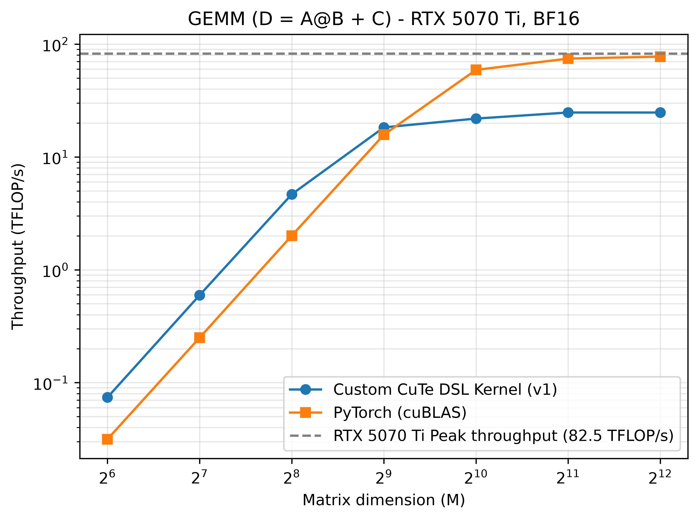

# I/ Results


# II/ The most basic GEMM in CuTe DSL

## A) Choices made

For the first GEMM kernel, I decided that I would use as less APIs as possible to
keep the kernel and host function as basic as possible.
I did not use any `tiled_copy` nor any `predicate tensors`. I did not use many 
optimisations available in CuTe so as to understand the basics of a GEMM.

My first kernel (v0) does the following :
- load elements from the global memory to the registers (A, B and C)
- compute the GEMM using `cute.gemm` with the accumulator living in the registers
- store elements from the registers to the global memory

There are no `swizzling`, use of `shared memory` and whatever else.

From this basic kernel, I will implement in future version of this GEMM kernel 
predicates, use of shared memory, swizzling, ...

## B) Memory or Compute Bound?

The ridge point is a property of the hardware, not of the kernel: it is the same for
every version in this repo. All measurements are taken on an RTX 5070 Ti with the core
clock locked at 2.30 GHz, where the BF16-input / FP32-accumulation tensor throughput is
`82.5 TFLOP/s`. Locking the core clock does not affect memory bandwidth, which stays at
`896 GB/s`. Hence:

> ridge point = 82.5 TFLOP/s ÷ 896 GB/s ≈ **92 FLOPs/byte**

What changes from one version to the next is the arithmetic intensity
`AI = FLOPs / bytes`, since each kernel moves a different amount of data.

The count below is the *algorithmic* one: each tensor is assumed to cross HBM exactly
once, repeated tile loads being served from cache. It is therefore an upper bound on AI -
a kernel that re-fetches its tiles moves more bytes and sits lower. It serves as a common
reference across versions, not as a description of what v0 actually does.

The kernel computes `D = A·B + C` with four distinct tensors, all in BF16 (2 bytes/element):
- load `A` (M, K): `2·M·K`
- load `B` (N, K): `2·N·K`
- load `C` (M, N): `2·M·N`
- store `D` (M, N): `2·M·N`

FLOPs: `2·M·N·K` for the product; the `M·N` additions of the epilogue are negligible
against `O(M·N·K)`.

All tests and profilings use square matrices, so `M = N = K`:
- FLOPs = `2·M³`
- bytes = `8·M²`
- **`AI = M / 4`**

The crossover is at `M = 368`, i.e. from `M = 512` onward for power-of-two sizes. Under
this idealized model, a kernel is expected to be memory-bound at `M = 256` and below,
compute-bound at `M = 512` and above.

One caveat, which §E will make concrete: the roofline predicts a memory-bound regime only
*provided the kernel saturates the bandwidth*, and a compute-bound one only provided it
saturates the tensor cores. A kernel can be limited by something the model does not
describe - which is exactly what happens to v0.

## C) Decicions made in the kernel

The biggest decision that had to be taken is regarding the data types.

All tensors are in `bf16`. The MMA operation covering F16/BF16 inputs,
[`cute.nvgpu.warp.MmaF16BF16Op`](https://docs.nvidia.com/cutlass/latest/media/docs/pythonDSL/cute_dsl_api/cute_nvgpu_warp.html#cutlass.cute.nvgpu.warp.MmaF16BF16Op),
takes `acc_dtype` as a constructor argument but restricts the admissible combinations:

| A Data Type | B Data Type | Acc Type | Mma-MNK |
|---|---|---|---|
| F16 | F16 | F16, F32 | (16,8,8), (16,8,16) |
| BF16 | BF16 | F32 | (16,8,8), (16,8,16) |

The F16 row is what makes the constraint concrete: F16 inputs may accumulate in either
precision, BF16 inputs may not. With BF16 operands the accumulator has to be FP32.

``` python
tCrC = cute.make_rmem_tensor_like(tCgC, mC.dtype)
cute.copy(atom_copy_cd, tCgC, tCrC,)

tCrC_f32 = cute.make_rmem_tensor_like(tCgC, cutlass.Float32)
tCrC_f32.store(tCrC.load().to(cutlass.Float32))
...
cute.gemm(tiled_mma, tCrC_f32, tCrA, tCrB, tCrC_f32)
...
tCrC.store(tCrC_f32.load().to(mC.dtype))
```

The other way to do it is to initialize a tensor in rmem in FP32 at 0.0, use it as an
accumulator and then do the addition in the end by recasting the accumulator down to BF16.

Both versions compile to 38 registers per thread (NCU, Registers Per Thread). The version above 
is the one kept: loading C directly as the initial value of the accumulator folds the + C into 
the MMA chain and removes the epilogue addition entirely.

## D) Benchmark


The benchmark produces the following results with square matrices (clock at `2.30 GHz`):

| Metric | Value Custom kernel | Value PyTorch |
|---|---|---|
| Throughput (M = 64) | ~0.07 TFLOP/s | ~0.03 TFLOP/s |
| Throughput (M = 128) | ~0.6 TFLOP/s | ~0.26 TFLOP/s |
| Throughput (M = 256) | ~4.8 TFLOP/s | ~2.1 TFLOP/s |
| Throughput (M = 512) | ~6.0 TFLOP/s | ~17 TFLOP/s |
| Throughput (M = 1024) | ~6.5 TFLOP/s | ~58 TFLOP/s |
| Throughput (M = 2048) | ~6.7 TFLOP/s | ~76 TFLOP/s |
| Throughput (M = 4096) | ~7.0 TFLOP/s | ~79 TFLOP/s |

The maximum compute on this GPU at this locked clock is equal to : `82.5 TFLOP/s`.
My first GEMM kernel is much lower than the kernel from PyTorch.
It was to be expected that my kernel would have such low throughput. Let's launch a profiling
to understand what went wrong exactly.


## E) Nsight Compute Report

The profiled shape is `M = N = K = 2048`. The GPU clock is fixed at `2.30 GHz`.

The Speed of Light report gives us this information : 

| Metric | Value |
|---|---|
| Compute (SM) throughput | 25.92% |
| Memory throughput | 93.79% |
| L1 Cache Throughput | 87.67% |
| L2 Cache Throughput | 93.79% |
| DRAM throughput | 1.18% |

These metrics contradict the prediction of §B, and the way they contradict it is
informative.

At `M = 2048` the model predicts a compute-bound kernel. Compute throughput sits at
25.92%: the tensor cores are idle most of the time. But the kernel is not compute-bound
*and* free of a memory problem either - the memory pipeline is at 93.79%, i.e. saturated.

The point is that this saturation does not live in DRAM, which sits at 1.18%. The SOL
memory figure tracks the L2 throughput exactly (93.79%), with L1 close behind (87.67%):
what is saturated is the cache/LSU path, not the link to HBM. The kernel is not limited by
the *volume* of data it moves - it moves very little - but by the *number of memory
requests* it issues to move it.

The Scheduler Statistics section shows the consequence: `No Eligible` is at 94.08%,
meaning that for 94% of cycles a scheduler has no warp ready to issue. The warps are not
idle for lack of work; they are blocked on loads queued behind a saturated LSU. The stalls
are the symptom, the request flood is the cause.

Two things produce that flood, and both are visible in the kernel.

By construction of the kernel, there is no coalescing to get the data from the global memory.
All copies follow the same principle in the kernel : 

```python
tile_cd = ((None, None), (bidx, bidy))
gC = mC[tile_cd]
tCgC = thr_mma.partition_C(gC)
tCrC = cute.make_rmem_tensor_like(tCgC, mC.dtype)
cute.copy(atom_copy_cd, tCgC, tCrC,)
```

This means that I use the `ThrMma` class instead of using the `ThrCopy` class. The former has a
specific thread-value layout adapted for the Tensor Cores. The latter can be initialized to have 
the best thread-value layout to maximize coalescing.

Therefore, in each loop : 
``` python
for k in cutlass.range(nb_tiles_k):
    ...
    tCgA = thr_mma.partition_A(gA)
    tCgB = thr_mma.partition_B(gB)

    cute.copy(atom_copy_ab, tCgA, tCrA,)
    cute.copy(atom_copy_ab, tCgB, tCrB,)
```

We can see here that the uncoalesced TV layout from `thr_mma` is used to copy the elements from A and B
(the same problem stands for the tensor C).
Therefore, for each and every iteration of the loop, new elements are copied from the global memory to the
registers. I did not put into place any strategies to store in the `shared memory` elements that are used
in the tile. 
The caches absorb most of these requests - hence the 1.18% DRAM throughput - but absorbing them is
precisely what saturates the L1/L2 path.

Furthermore, no vectorization has been put in place. Consequently, half of the lines in the SASS code are 
load instructions from the global memory. Here is one example : 
```
LDG.E.U16 R14, desc[UR6][R22.64]
```

There is also another pice of advice from the SASS code. Next to each `LDG` instruction, there is marked :
`75% of this line's global accesses are excessive`. This is another problem to tackle.

## F) Planned Improvements

From what was found in the NCU Report, my first GEMM kernel can benefit from 2 major improvements :
- using the shared memory to load once all the elements from the tile and reduce consequently all transfer costs
- use `tiled_copy` to load from gmem to smem and vice-versa
- using the vectorization up to 128 bits


# III/ GEMM kernel using the Shared Memory

## A) Choices made

For this second kernel, named `gemm_kernel_v1`, the following implementations have been done : 
- use of `tiled_copy` to make use as much as possible of the coalescing
- use fo the `shared memory` available on each SM

An attempt at using the vectorization has been done but to no avail. This point will be discussed later on in
this section. We will focus on the two new main elements cited above.

## B) Choices made

Let us first talk about the `tiled copies`. This will explain why there is a need for the `shared memory`.

In the former `gemm_kernel_v0`, the elements would be loaded from the global memory to the registers. The 
accesses would not be coalesced as the `thread-value` layout would be to comply to the conditions of the 
`tensor cores`. Therefore, the `TV layout` is optimized for the tensor cores and not for coalescing.

That is when both the `shared memory` and `tiled_copy` come into play. The pipeline will be the following:
- load data from the global memory to the shared memory using coalescing
- load data from the global memory to the registers following conditions of the tensor cores
- compute the GEMM
- load the accumulator (result) from the registers to the shared memory
- load the result of the tile of D from the shared memory to the global memory using coalescing

The shared memory is highly useful for storing data that will be used in the near future.
The block shares parts of the tile loaded which allows to reduce the number of requests to the global memory.

Futhermore, shared memory and global memory do not have the same constraints. To optimize the global memory, accesses
must be coalesced. On the other hand, to optimize the shared memory, the elements that the 32 threads in a warp want
to access must not create a bank conflict. §III-D shows this kernel does hit bank conflicts.

The `tiled_copy` for the three types of transfers are all defined on the host side. I give the snipper for the
creation of a single `tiled_copy`, the other twos follow the same ideas.

``` python
shape_mnk = (16, 8, 16)
atom_layout_mnk = (4, 4, 1)

bs_m = shape_mnk[0] * atom_layout_mnk[0]
bs_k = shape_mnk[2] * atom_layout_mnk[2]

max_nb_elems_per_thr = 8    # vectorization bf16

bs_m = shape_mnk[0] * atom_layout_mnk[0]
bs_k = shape_mnk[2] * atom_layout_mnk[2]

nb_elems_per_thr_mk = min(nb_elems_mk // nb_theads_per_block, max_nb_elems_per_thr)

val_layout_mk = cute.make_layout((1, nb_elems_per_thr_mk), stride=(0, 1))
thr_layout_mk = cute.make_layout((bs_m, bs_k//nb_elems_per_thr_mk), stride=(bs_k//nb_elems_per_thr_mk, 1))


op_copy = cute.nvgpu.CopyUniversalOp()
copy_atom_mk = cute.make_copy_atom(
    op_copy,
    mA.dtype,
)

tiler_mk, layout_tv_mk = cute.make_layout_tv(
    thr_layout_mk,
    val_layout_mk,
)

tiled_copy_mk = cute.make_tiled_copy(
    copy_atom_mk,
    layout_tv_mk,
    tiler_mk,
)
```

A very important decision has been made here, which has repercussions on the vectorization. I decided to
load in shared memory the exact tile that the `tiled_mma` needed. Furthermore, I gave to each thread in 
all the tiled copies the exact same work.

The consequence is the lack of possible vectorization. Here is a calculation to demonstrate it.
Here is the situation :
- `M = N = K = 256`
- `shape_mnk = (16, 8, 16)`
- `atom_layout_mnk= (4, 4, 1)`

In this case, the number of elements per thread for the tile A is equal to `2`. Following the same code 
as above, we can fin that for the tile B, it is equal to `1` and for the tile C, it is equal to `4`.

In this case, vectorization using `num_bits_per_copy=128` is impossible.

This is the consequence of the choice I made, which is a choice guided by simplicity.

No choices have been made for the `shared memory` except in the initialization of each space in the kernel.

```python
smem = cutlass.utils.SmemAllocator()
sA = smem.allocate_tensor(
    mA.dtype,
    cute.make_layout((bs_m, bs_k), stride=(bs_k, 1)),
    byte_alignment=16,
)
```

Why do I allocate `(bs_m, bs_k)` and not `(bs_m, K)` ?

Loading such a big tile would result in keeping in storage a lot of elements that are useless. Indeed,
after a block in the grid is done using an elementary tile of `A[bidx, k]` for instance, then is is no longer of
any use. Therefore, loading a huge tile would lead to having "dead elements".

There is also a reason coming from the limits of my GPU.

The allocated shared memory can store an elementary tile for `shape_mnk = (16, 8, 16)`.It is possible to use only 
99 KiB of shared memory. Let us do another small calculation to understand what the problem is.

The situation is the same as before:
- `M = N = K = 256`
- `shape_mnk = (16, 8, 16)`
- `atom_layout_mnk= (4, 4, 1)`

Therefore, an elementary tile of A takes `2 * (16 * 16) * (4 * 1) B` which is equal to `2048 B`. A full tile
of A would be equal to : `2 * (16 * 256) * (4 * 1) B` which is equal to `32 KiB`. 

Following these calculations, an upper bound for these restricted shapes would be around `70 KiB` (`32*2` for A 
and B and a smaller portion for C but negligible compared to loading the whole dimension K). 
Besides, this would-be configuration would not scale at all. If I were to use the shapes of the profiling, i.e.  
`M = N = K = 2048`, the tile of A would not fit in the shared memory.


## C) Benchmark



The benchmark produces the following results with square matrices (clock at `2.30 GHz`):

| Metric | Value Custom kernel | Value PyTorch |
|---|---|---|
| Throughput (M = 64) | ~0.07 TFLOP/s | ~0.03 TFLOP/s |
| Throughput (M = 128) | ~0.6 TFLOP/s | ~0.26 TFLOP/s |
| Throughput (M = 256) | ~4.8 TFLOP/s | ~2.1 TFLOP/s |
| Throughput (M = 512) | ~19 TFLOP/s | ~17 TFLOP/s |
| Throughput (M = 1024) | ~22 TFLOP/s | ~58 TFLOP/s |
| Throughput (M = 2048) | ~26 TFLOP/s | ~76 TFLOP/s |
| Throughput (M = 4096) | ~27 TFLOP/s | ~79 TFLOP/s |

The second kernel has much better performances than the previous one `gemm_kernel_v0`. At high input sizes, 
there is more than a `3 times` increase in TFLOP/s.

Below `M = 512`, my kernel is ahead of the PyTorch reference. This is worth noting but
says little about the kernel itself: `gemm_kernel_v0` and `gemm_kernel_v1` post identical
numbers in that range, so the gap does not come from any of the optimizations discussed
here. A plausible explanation is launch and dispatch overhead dominating at problem sizes
this small, but I have not profiled these shapes to confirm it.

Now, onto the profiling to understand where are the problems and what gains can be made.

## D) Nsight Compute report

The profiled shape is `M = N = K = 2048`. The GPU clock is fixed at `2.30 GHz`.

The Speed of Light report gives us this information : 

| Metric | Value |
|---|---|
| Compute (SM) throughput | 50.65% |
| Memory throughput | 86.71% |
| L1 Cache Throughput | 88.31% |
| L2 Cache Throughput | 48.55% |
| DRAM throughput | 2.75% |

With these SoL metrics, we can now compare effectively the two kernels. 
First, there is a `two-fold` increase in `Compute Thoughput` and `DRAM Throughput` which can be seen as a sign
of the kernel not being bottlenecked as much as before by the L1 and L2 caches.

Second, the kernel is still memory-bound and especially by the L1-cache. The NCU report tells us one more thing
about the shared memory : there is a 2-way bank conflict. Indeed, as no swizzling was used in this kernel, a
bank conflict had high chances to appear.

Third, there are four lines in the SASS code with a high `Warp Stall Sampling`. Here are the snippets : 

```
LDG.E R23, desc[UR6][R36.64]
STS [R20+UR5], R23
```
The second line has a warp stall of `14%`. This means that the thread spends time idle while waiting for the 
first transfer, from the global memory to the register, to then store it in the shared memory.

Here is another snippet with the same situation.

```
LDG.E R19, desc[UR6][R36.64+0x20]
(two other lines not using the register R19)
STS [R20+UR5], R19
```
The second line has a warp stall of `10%`.

This is the same pattern as the example above : the thread had to wait for data to arrive to the register, here
`R19` before sending the data to the shared memory. The other two stalls follow the same principle. Therfore,
to solve such stalls (around `40%` of the time of the kernel), we would need to load data from the `global
memory` directly to the `shared memory`. An instruction fills all the conditions : `cp.async`. This would 
allow the thread to load data from the global memory to the shared memory and then be able to do other things
while the transfer is ongoing.


## E) Planned Improvements

The `gemm_kernel_v1` was able to put some light on improvements that were partially sucessful. The imlpemenation
of the three `tiled_copy`, the use of `shared memory` and the vectorization were naive. Despite this, some tangible
gains were made.

The next kernel will do the following:
- use vectorization of `128 bits`
- resolve bank conflicts of the `shared memory`

The implementation of `cp.async` will be done later on as it is more important to implement correctly everything 
that exists.

# IV/ GEMM kernelwith full vectorization and bank conflict-less

