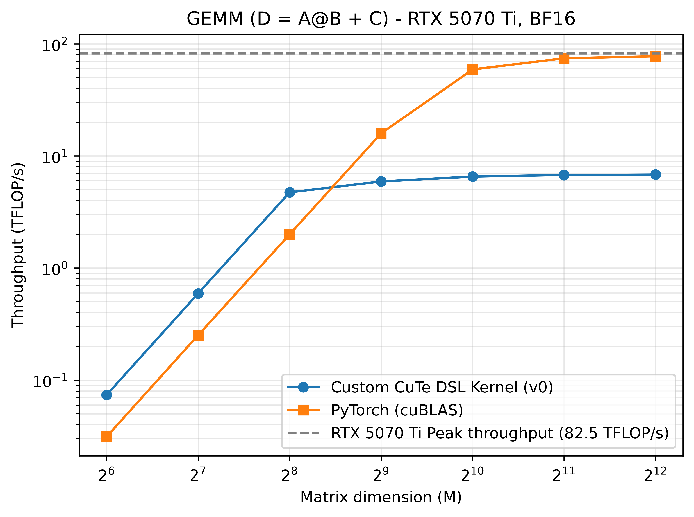

# I/ Results


# II/ The most basic GEMM in CuTe DSL

## A) Choices made

For the first GEMM kernel, I decided that I would use as less APIs as possible to
keep the kernel and host function as basic as possible.
I did not use any `tiled_copy` nor any `predicate tensors`. I did not use many 
optimisations available in CuTe so as to understand the basics of a GEMM.

My first kernel (v0) does the following :
- load elements from the global memory to the registers (A, B and C)
- compute the GEMM using `cute.gemm` with the accumulator living in the registers
- store elements from the registers to the global memory

There are no `swizzling`, use of `shared memory` and whatever else.

From this basic kernel, I will implement in future version of this GEMM kernel 
predicates, use of shared memory, swizzling, ...

## B) Memory or Compute Bound?

The ridge point is a property of the hardware, not of the kernel: it is the same for
every version in this repo. All measurements are taken on an RTX 5070 Ti with the core
clock locked at 2.30 GHz, where the BF16-input / FP32-accumulation tensor throughput is
`82.5 TFLOP/s`. Locking the core clock does not affect memory bandwidth, which stays at
`896 GB/s`. Hence:

> ridge point = 82.5 TFLOP/s ÷ 896 GB/s ≈ **92 FLOPs/byte**

What changes from one version to the next is the arithmetic intensity
`AI = FLOPs / bytes`, since each kernel moves a different amount of data.

The count below is the *algorithmic* one: each tensor is assumed to cross HBM exactly
once, repeated tile loads being served from cache. It is therefore an upper bound on AI -
a kernel that re-fetches its tiles moves more bytes and sits lower. It serves as a common
reference across versions, not as a description of what v0 actually does.

The kernel computes `D = A·B + C` with four distinct tensors, all in BF16 (2 bytes/element):
- load `A` (M, K): `2·M·K`
- load `B` (N, K): `2·N·K`
- load `C` (M, N): `2·M·N`
- store `D` (M, N): `2·M·N`

FLOPs: `2·M·N·K` for the product; the `M·N` additions of the epilogue are negligible
against `O(M·N·K)`.

All tests and profilings use square matrices, so `M = N = K`:
- FLOPs = `2·M³`
- bytes = `8·M²`
- **`AI = M / 4`**

The crossover is at `M = 368`, i.e. from `M = 512` onward for power-of-two sizes. Under
this idealized model, a kernel is expected to be memory-bound at `M = 256` and below,
compute-bound at `M = 512` and above.

One caveat, which §E will make concrete: the roofline predicts a memory-bound regime only
*provided the kernel saturates the bandwidth*, and a compute-bound one only provided it
saturates the tensor cores. A kernel can be limited by something the model does not
describe - which is exactly what happens to v0.

## C) Decicions made in the kernel

The biggest decision that had to be taken is regarding the data types.

All tensors are in `bf16`. According to the `CuTe DSL` documentation, with such input,
the accumulator must be in `fp32`.

``` python
tCrC = cute.make_rmem_tensor_like(tCgC, mC.dtype)
cute.copy(atom_copy_cd, tCgC, tCrC,)

tCrC_f32 = cute.make_rmem_tensor_like(tCgC, cutlass.Float32)
tCrC_f32.store(tCrC.load().to(cutlass.Float32))
...
cute.gemm(tiled_mma, tCrC_f32, tCrA, tCrB, tCrC_f32)
...
tCrC.store(tCrC_f32.load().to(mC.dtype))
```

The other way to do it is to initialize a tensor in rmem in FP32 at 0.0, use it as an
accumulator and then do the addition in the end by recasting the accumulator down to BF16.

Both versions compile to 38 registers per thread (NCU, Registers Per Thread). The version above 
is the one kept: loading C directly as the initial value of the accumulator folds the + C into 
the MMA chain and removes the epilogue addition entirely.

## D) Benchmark



The benchmark produces the following results with square matrices (clock at `2.30 GHz`):

| Metric | Value Custom kernel | Value PyTorch |
|---|---|---|
| Throughput (M = 64) | ~0.07 TFLOP/s | ~0.03 TFLOP/s |
| Throughput (M = 128) | ~0.6 TFLOP/s | ~0.26 TFLOP/s |
| Throughput (M = 256) | ~4.8 TFLOP/s | ~2.1 TFLOP/s |
| Throughput (M = 512) | ~6.0 TFLOP/s | ~17 TFLOP/s |
| Throughput (M = 1024) | ~6.5 TFLOP/s | ~58 TFLOP/s |
| Throughput (M = 2048) | ~6.7 TFLOP/s | ~76 TFLOP/s |
| Throughput (M = 4096) | ~7.0 TFLOP/s | ~79 TFLOP/s |

The maximum compute on this GPU at this locked clock is equal to : `82.5 TFLOP/s`.
My first GEMM kernel is much lower than the kernel from PyTorch.
It was to be expected that my kernel would have such low throughput. Let's launch a profiling
to understand what went wrong exactly.


## E) Nsight Compute Report

The profiled shape is `M = N = K = 2048`. The GPU clock is fixed at `2.30 GHz`.

The Speed of Light report gives us this information : 

| Metric | Value |
|---|---|
| Compute (SM) throughput | 25.92% |
| Memory throughput | 93.79% |
| L1 Cache Throughput | 87.67% |
| L2 Cache Throughput | 93.79% |
| DRAM throughput | 1.18% |

These metrics contradict the prediction of §B, and the way they contradict it is
informative.

At `M = 2048` the model predicts a compute-bound kernel. Compute throughput sits at
25.92%: the tensor cores are idle most of the time. But the kernel is not compute-bound
*and* free of a memory problem either - the memory pipeline is at 93.79%, i.e. saturated.

The point is that this saturation does not live in DRAM, which sits at 1.18%. The SOL
memory figure tracks the L2 throughput exactly (93.79%), with L1 close behind (87.67%):
what is saturated is the cache/LSU path, not the link to HBM. The kernel is not limited by
the *volume* of data it moves - it moves very little - but by the *number of memory
requests* it issues to move it.

The Scheduler Statistics section shows the consequence: `No Eligible` is at 94.08%,
meaning that for 94% of cycles a scheduler has no warp ready to issue. The warps are not
idle for lack of work; they are blocked on loads queued behind a saturated LSU. The stalls
are the symptom, the request flood is the cause.

Two things produce that flood, and both are visible in the kernel.

By construction of the kernel, there is no coalescing to get the data from the global memory.
All copies follow the same principle in the kernel : 

```python
tile_cd = ((None, None), (bidx, bidy))
gC = mC[tile_cd]
tCgC = thr_mma.partition_C(gC)
tCrC = cute.make_rmem_tensor_like(tCgC, mC.dtype)
cute.copy(atom_copy_cd, tCgC, tCrC,)
```

This means that I use the `ThrMma` class instead of using the `ThrCopy` class. The former has a
specific thread-value layout adapted for the Tensor Cores. The latter can be initialized to have 
the best thread-value layout to maximize coalescing.

Therefore, in each loop : 
``` python
for k in cutlass.range(nb_tiles_k):
    ...
    tCgA = thr_mma.partition_A(gA)
    tCgB = thr_mma.partition_B(gB)

    cute.copy(atom_copy_ab, tCgA, tCrA,)
    cute.copy(atom_copy_ab, tCgB, tCrB,)
```

We can see here that the uncoalesced TV layout from `thr_mma` is used to copy the elements from A and B
(the same problem stands for the tensor C).
Therefore, for each and every iteration of the loop, new elements are copied from the global memory to the
registers. I did not put into place any strategies to store in the `shared memory` elements that are used
in the tile. 
The caches absorb most of these requests - hence the 1.18% DRAM throughput - but absorbing them is
precisely what saturates the L1/L2 path.

Furthermore, no vectorization has been put in place. Consequently, half of the lines in the SASS code are 
load instructions from the global memory. Here is one example : 
```python
LDG.E.U16 R14, desc[UR6][R22.64]
```

There is also another pice of advice from the SASS code. Next to each `LDG` instruction, there is marked :
`75% of this line's global accesses are excessive`. This is another problem to tackle.

## F) Planned Improvements

From what was found in the NCU Report, my first GEMM kernel can benefit from 2 major improvements :
- using the shared memory to load once all the elements from the tile and reduce consequently all transfer costs
- use `tiled_copy` to load from gmem to smem and vice-versa
- using the vectorization up to 128 bits

